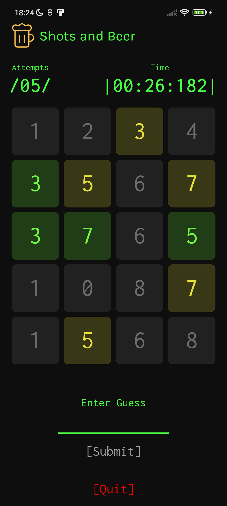

# Shots and Beer
A simple mobile game made originally for the TDL School Course in 2021, learning about Android development and industry best practices.

The user has to guess 4-5-6 numbers, based on the chosen difficulty, and he can see his previous input results - if a number is correctly guessed in the correct place, it shows up as green, if it is guessed but not in the correct place - yellow, otherwise it is grey.

After winning the game, his score is saved (attempts made and time), which he can go on to view in the High Scores menu. Lost/unfinished games are not counted.

This was my first ever app in Android, starting my mobile development passion!

## Screenshots
|                             |                            |                                  |                                 |
|:---------------------------:|:--------------------------:|:--------------------------------:|:-------------------------------:|
|  |  |  |  |

## Technologies
- MVVM
- Hilt
- Room
- Timber
